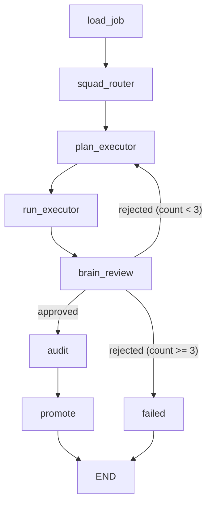

# Antigravity MVP Architecture

NIM-Kinetic Meta-Agent MVP — 自律型AIエージェントの実行基盤

## Overview

Antigravity は、LangGraph 上に構築された自律型AIエージェントの実行基盤です。
JOBファイル（Markdown + YAML frontmatter）を受信し、ドメインに応じた Squad（専門AIチーム）を
ルーティング・実行・レビュー・監査する一連のフローを自律的に完走します。

## Architecture

### Graph Structure



- **plan_executor** (Brain): objective 構築、review_feedback 注入
- **run_executor** (Executor): squad 実行、artifact 書き出し
- **brain_review** (L2): artifact 品質レビュー、pass/fail 判断
- **audit**: シークレットスキャン、ドメイン漏洩チェック

### Sandbox (3-tier fallback)
- Tier 1: e2b cloud sandbox (Remote execution)
- Tier 2: local venv (`work/sandbox_venv/`)
- Tier 3: skip with WARN log (Fallback)

### Security
- `subprocess` の使用は `utils/safe_subprocess.py` に集約
- `scripts/scope_guard.py` で静的解析し、不正な `subprocess` 使用を遮断

## Phase Status

| Phase | Status | Description |
|-------|--------|-------------|
| A | Done | Multi-Domain Wiki + KnowledgeOS |
| B | Done | LangGraph + HITL (Gate 1/2/3) + Audit |
| C | Done | L2 Brain↔Developer 分離 + フィードバックループ |
| D | Done | Brain↔Executor ノード分離 + coding_sandbox 強化 |
| E | TBD | （次のフェーズ）|

## Quick Start

```bash
# Python 3.12+ required
python -m venv venv
source venv/bin/activate  # Windows: venv\Scripts\activate
pip install -r requirements.txt

# Run tests
$env:PYTHONPATH="."; pytest tests/ -v --tb=short

# Security check
python scripts/scope_guard.py .

# Run a job
python -m apps.runtime.graph work/jobs/sample_job.md
```

## Project Structure

```
apps/
├── runtime/
│   ├── graph.py              # LangGraph orchestrator
│   ├── state.py              # State schema (TypedDict)
│   ├── sandbox_executor.py   # 3-tier sandbox strategy
│   └── nodes/
│       ├── plan_executor.py  # Brain node (Objective construction)
│       └── run_executor.py   # Executor node (Squad execution)
├── crew/
│   └── squad_executor.py     # Squad execution engine (CrewAI wrapper)
├── llm_router/
│   └── router.py             # Unified LLM router (NIM + Ollama)
└── ...
domains/                      # Domain-specific wiki storage (KnowledgeOS)
scripts/
├── scope_guard.py            # Security static analyzer
├── brain_review.py           # Review squad CLI
├── audit.py                  # Artifact audit logic
└── promote.py                # Wiki promotion script
tests/                        # 27 core tests + 11 legacy (skipped)
utils/
└── safe_subprocess.py        # Subprocess wrapper with venv support
work/
├── artifacts/staging/        # Execution outputs
├── blackboard/               # Review queue & feedback
└── sandbox_venv/             # Local sandbox environment
```

## Requirements
- Python 3.12+
- CrewAI / LangGraph / LangChain
- NVIDIA API Key (Optional for NIM)
- E2B API Key (Optional for Cloud Sandbox)
