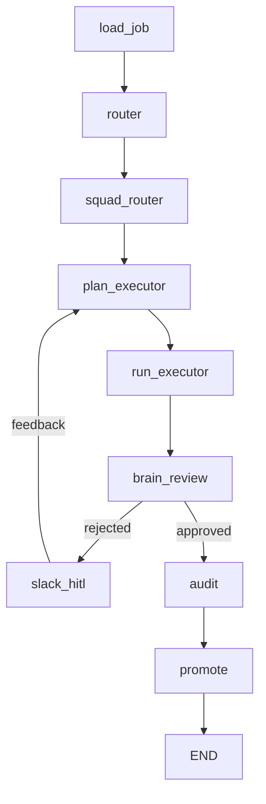

# Antigravity MVP Architecture

NIM-Kinetic Meta-Agent MVP — 自律型AIエージェントの実行基盤（冷徹な観察システム）

## Overview

Antigravity は、LangGraph 上に構築された次世代の自律型AIエージェント実行基盤です。
JOBファイル（Markdown + YAML frontmatter）を起点とし、ドメイン特化型の Squad（専門AIチーム）を並列制御・監査・自己進化させながら完走します。

## Core Features (MVP Final)

- **3-Tier Execution Sandbox**: 物理隔離された実行環境の自動スイッチング。
    - Tier 1: `e2b` Cloud Sandbox (リモート)
    - Tier 2: `Docker` Container (`antigravity-sandbox`) による完全隔離実行
    - Tier 3: Local `venv` または Skip (フォールバック)
- **Asynchronous Slack HITL**: Slack Socket Mode を介した非同期な人間介入（Human-In-The-Loop）。
    - モバイル端末からジョブの承認・拒否・フィードバック送信が可能。
    - 拒否時のフィードバックは即座にプランナーへ反映。
- **Continuous Knowledge Synthesis**: FAISS + 多言語 Embedding による自己進化メカニズム。
    - 過去の Reject 理由をベクトルDBに蓄積し、類似タスクの立案時に「教訓」として自動注入。
- **High-Performance Parallelism**: `ThreadPoolExecutor` と SQLite WAL モードによる安全な並列ジョブ実行。

## Architecture

### Graph Structure (Self-Evolution Flow)



- **plan_executor** (Self-Evolution): ベクトルDBから過去の教訓（Lessons Learned）を抽出しプロンプトへ注入。
- **run_executor** (Executor): Docker サンドボックス内での安全なコード実行。
- **slack_hitl**: 承認ボタン・拒否モーダルを介した非同期な人間との対話。

## Environment Variables

Copy `.env.example` to `.env` and configure:

- `SLACK_BOT_TOKEN` / `SLACK_APP_TOKEN` — Slack 連携用
- `SLACK_ADMIN_USER_IDS` — 操作を許可する管理者ID（カンマ区切り）
- `DOCKER_CPU_LIMIT` / `DOCKER_MEM_LIMIT` — サンドボックスのリソース制限

## Phase Status

| Phase | Status | Description |
|-------|--------|-------------|
| A-D | Done | 基礎基盤、Squad連携、L2 Brain 構築 |
| E | Done | Stability & Expansion (Sandbox 強化、並列化) |
| F | Done | Logging & Observability (集中ログ管理、監査ログ) |
| G | Done | **Production Hardening & Self-Evolution (Slack HITL, Docker, Vector Memory)** |

## Quick Start

```bash
# 依存関係のインストール
pip install -r requirements.txt

# デーモンの起動 (Slack 待機 & ジョブ監視)
python apps/daemon/wiki_daemon.py
```

## Project Structure

```
apps/
├── runtime/
│   ├── graph.py              # LangGraph orchestrator
│   ├── state.py              # State schema (TypedDict)
│   ├── sandbox_executor.py   # 3-tier sandbox strategy
│   └── nodes/
│       ├── plan_executor.py  # Brain node (Objective construction)
│       └── run_executor.py   # Executor node (Squad execution)
├── crew/
│   └── squad_executor.py     # Squad execution engine (CrewAI wrapper)
├── llm_router/
│   └── router.py             # Unified LLM router (NIM + Ollama)
└── ...
domains/                      # Domain-specific wiki storage (KnowledgeOS)
scripts/
├── scope_guard.py            # Security static analyzer
├── brain_review.py           # Review squad CLI
├── audit.py                  # Artifact audit logic
└── promote.py                # Wiki promotion script
tests/                        # 43 tests (27 core + 16 added in Phase E)
├── test_sandbox_live.py  # Tier 2 sandbox live validation tests [NEW]
└── test_run_executor.py  # Parallel execution mode tests [NEW]
doc/                      # Phase completion reports and documentation
└── phase_e_completion_report.md
utils/
└── safe_subprocess.py        # Subprocess wrapper with venv support
work/
├── artifacts/staging/        # Execution outputs
├── blackboard/               # Review queue & feedback
└── sandbox_venv/             # Local sandbox environment
```

## Requirements
- Python 3.12+
- CrewAI / LangGraph / LangChain
